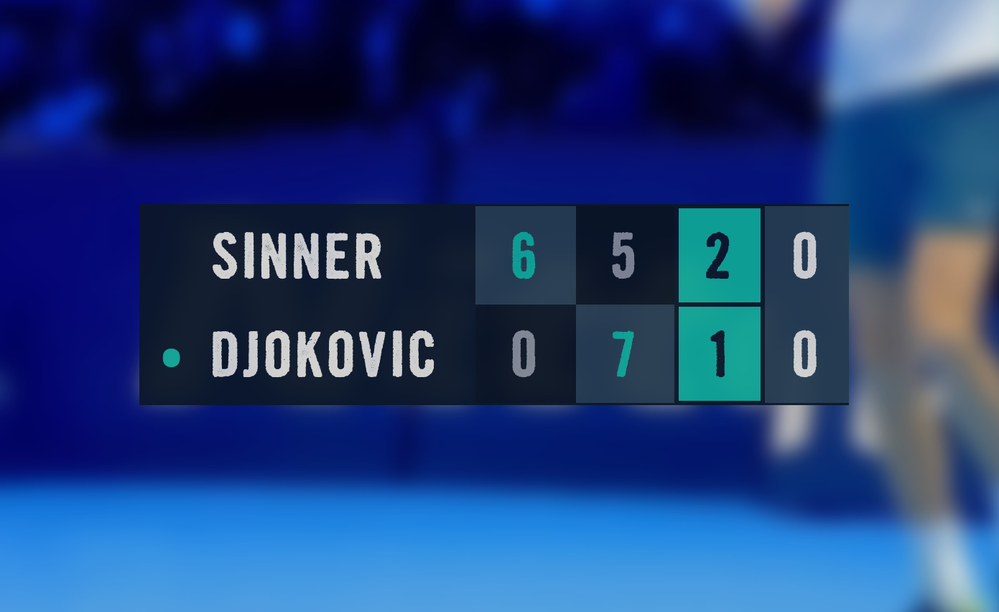

# E2E Tennis Kata

Develop a scorekeeper for tennis matches.



## Setup

Build and run via gradle

```
$ ./gradlew run
```

> visit `http://localhost:8080`

or build it for dist

```
$ ./gradlew installDist
```

and run the dist executable

```
$ ./build/install/EndToEndTennisKata/bin/EndToEndTennisKata
```

## Dev

To use auto-reload, build with auto-watch

```
$ ./gradlew -t build
```

and run the application in another tab with

```
$ KTOR_DEVELOPMENT_MODE=true ./gradlew run
```
